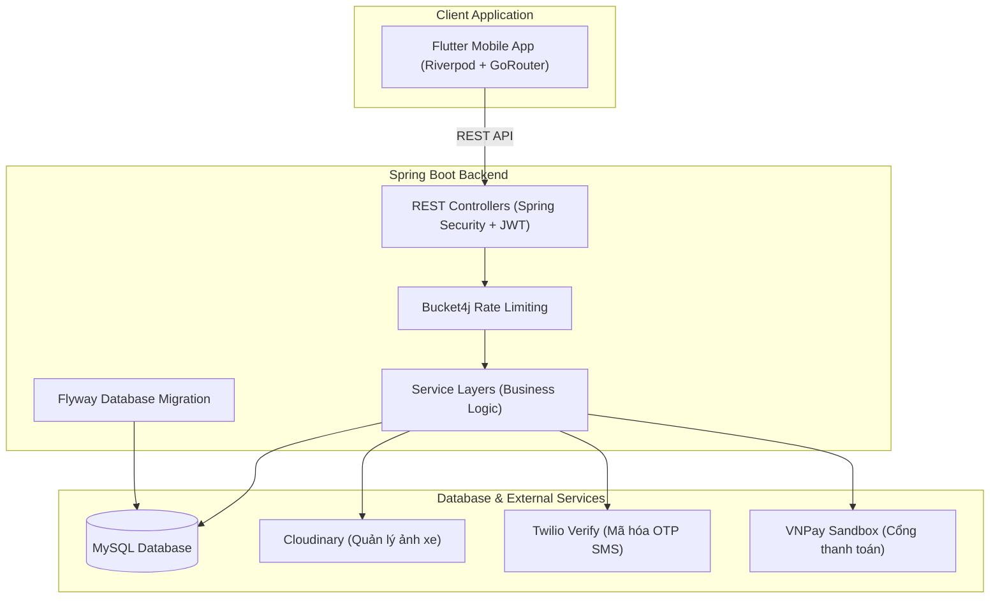

# GoRento — Hệ Thống Đặt & Thuê Xe Tự Lái (Full-Stack)

Hệ thống đặt & thuê xe tự lái GoRento là giải pháp full-stack toàn diện được thiết kế tối ưu cho nền tảng di động (mobile-first), bao gồm **Spring Boot RESTful API Backend** và **Flutter Mobile App**. Hệ thống tích hợp các luồng nghiệp vụ thực tế như thanh toán online VNPay, định vị bản đồ GPS thời gian thực, thiết lập địa điểm đón/trả trực quan trên bản đồ, xác thực OTP, và đánh giá phản hồi chất lượng xe.

---

## Quick Start — Chạy Backend

```bash
# 1. Di chuyển vào thư mục backend
cd backend

# 2. Chạy dev server (tự động migrate DB + seed data)
./gradlew bootRun

# Hoặc build JAR rồi chạy (production-style)
./gradlew bootJar -x test
java -jar build/libs/vehicle-booking-system-*.jar
```

> Backend sẽ lắng nghe tại **http://localhost:8080**  
> Swagger UI: **http://localhost:8080/swagger-ui.html**  
> Yêu cầu: Java 21 + MySQL đang chạy + đã cấu hình `application-dev.properties` (xem [Mục 6.1](#61-khởi-chạy-backend-spring-boot))

---

## Cấu Hình & Biến Môi Trường

> Tổng hợp **toàn bộ** thứ cần setup, lấy ở đâu, paste vào file nào trước khi chạy dự án.

---

### Backend — `backend/src/main/resources/application-dev.properties`

#### 1. MySQL Database

```properties
spring.datasource.url=jdbc:mysql://localhost:3306/vehicle_booking?useSSL=false&serverTimezone=Asia/Ho_Chi_Minh&allowPublicKeyRetrieval=true
spring.datasource.username=root
spring.datasource.password=root
```

| Biến | Mô tả | Lấy ở đâu |
|------|--------|-----------|
| `username` / `password` | Tài khoản MySQL local | MySQL Workbench hoặc tạo thủ công |
| Database name `vehicle_booking` | Phải tạo trước: `CREATE DATABASE vehicle_booking;` | MySQL CLI |

---

#### 2. JWT Secret

```properties
jwt.secret-key=VGhpc0lzQVN1cGVyU2VjdXJlU2VjcmV0S2V5Rm9ySFMyNTYxMjM0NTY3ODkwMTIzNDU2Nzg5MDEyMw==
jwt.expiration=900000
jwt.refresh-expiration=604800000
```

| Biến | Mô tả | Cách tạo |
|------|--------|---------|
| `jwt.secret-key` | Base64 key ≥ 32 bytes, dùng ký JWT | `openssl rand -base64 48` rồi paste |
| `jwt.expiration` | Access token TTL (ms) — mặc định 15 phút | Giữ nguyên cho dev |
| `jwt.refresh-expiration` | Refresh token TTL (ms) — mặc định 7 ngày | Giữ nguyên cho dev |

---

#### 3. Gmail SMTP (gửi OTP email)

```properties
spring.mail.username=your_email@gmail.com
spring.mail.password=xxxx xxxx xxxx xxxx
```

| Biến | Mô tả | Lấy ở đâu |
|------|--------|-----------|
| `spring.mail.username` | Gmail dùng để gửi OTP reset mật khẩu | Gmail bất kỳ |
| `spring.mail.password` | **App Password** (không phải mật khẩu Gmail) | [myaccount.google.com](https://myaccount.google.com) → Bảo mật → Xác minh 2 bước → **Mật khẩu ứng dụng** → Tạo mới → chọn "Mail" |

---

#### 4. Cloudinary (lưu ảnh xe)

```properties
cloudinary.cloud-name=your_cloud_name
cloudinary.api-key=your_api_key
cloudinary.api-secret=your_api_secret
cloudinary.folder=vehicle-booking/cars
```

| Biến | Lấy ở đâu |
|------|-----------|
| `cloud-name`, `api-key`, `api-secret` | [console.cloudinary.com](https://console.cloudinary.com) → Dashboard → **API Keys** |

---

#### 5. Twilio Verify (OTP SMS khi đăng ký)

```properties
# Dev: dùng mock, OTP cố định = 123456 — không cần key thật
twilio.mode=mock
twilio.mock-otp=123456

# Prod: đổi sang twilio và điền key thật
twilio.mode=twilio
twilio.account-sid=ACxxxxxxxxxxxxxxxxxxxxxxxxxxxxxxxx
twilio.auth-token=your_auth_token
twilio.verify-service-sid=VAxxxxxxxxxxxxxxxxxxxxxxxxxxxxxxxx
```

| Biến | Lấy ở đâu |
|------|-----------|
| `account-sid`, `auth-token` | [console.twilio.com](https://console.twilio.com) → **Account Info** |
| `verify-service-sid` | [console.twilio.com](https://console.twilio.com) → **Verify → Services** → tạo service mới → copy SID |

> **Dev tip:** Giữ `twilio.mode=mock` thì OTP luôn là `123456`, không cần tài khoản Twilio thật.

---

#### 6. VNPay Sandbox (thanh toán)

```properties
vnpay.tmn-code=YOUR_TMN_CODE
vnpay.hash-secret=YOUR_HASH_SECRET
vnpay.pay-url=https://sandbox.vnpayment.vn/paymentv2/vpcpay.html
vnpay.return-url=http://localhost:8080/api/payments/vnpay/return
vnpay.frontend-url=http://localhost:5173/my-bookings
```

| Biến | Lấy ở đâu |
|------|-----------|
| `tmn-code`, `hash-secret` | [sandbox.vnpayment.vn](https://sandbox.vnpayment.vn/devreg/) → Đăng ký tài khoản sandbox → **Website đang ký** → copy **Terminal ID** và **Secret Key** |

> **Dev tip:** Giữ giá trị `DUMMY...` thì flow tạo payment link vẫn hoạt động nhưng không verify được chữ ký — dùng để test UI. Cần key thật để thanh toán end-to-end.

---

#### 7. Firebase Admin SDK (xác thực phone OTP phía backend)

```properties
firebase.service-account-path=classpath:firebase-service-account.json
```

| Bước | Hành động |
|------|-----------|
| 1 | [console.firebase.google.com](https://console.firebase.google.com) → Chọn project → **Project Settings** |
| 2 | Tab **Service accounts** → **Generate new private key** → tải file JSON |
| 3 | Đổi tên thành `firebase-service-account.json` |
| 4 | Paste vào `backend/src/main/resources/firebase-service-account.json` |

---

#### 8. Mapbox (geocoding bản đồ)

```properties
mapbox.access-token=pk.eyJ1Ijoixxxxxx...
```

| Biến | Lấy ở đâu |
|------|-----------|
| `access-token` | [account.mapbox.com](https://account.mapbox.com) → **Tokens** → tạo Public Token mới |

---

#### 9. ViettelAI eKYC (xác minh danh tính — hardcoded trong code)

File: `backend/src/main/java/vehicle/booking/service/ViettelAiService.java`

```java
private static final String TOKEN = "93f3886be392ad743f665ac2200b40b7";
```

| Biến | Lấy ở đâu |
|------|-----------|
| `TOKEN` | [viettelai.vn](https://viettelai.vn) → Đăng ký tài khoản → **Dashboard** → **API Keys** → copy token eKYC |

> Token hiện tại là token dev/test. Để dùng production, thay giá trị trực tiếp trong file hoặc refactor thành `@Value("${viettelai.token}")`.

---

#### 10. Vietmap (bản đồ tile + geocoding Flutter — hardcoded)

File: `flutter_app/lib/src/features/booking/location_picker_dialog.dart`  
File: `flutter_app/lib/src/core/network/geocoding_service.dart`

```dart
// API key được hardcode:
'apikey=93f3886be392ad743f665ac2200b40b7'
```

| Biến | Lấy ở đâu |
|------|-----------|
| API key | [maps.vietmap.vn](https://maps.vietmap.vn) → Đăng nhập → **Tài khoản** → **API Keys** |

---

### Flutter — `flutter_app/lib/firebase_options.dart`

File này cấu hình Firebase cho **client Flutter** (xác thực số điện thoại phía app).

```dart
static const FirebaseOptions android = FirebaseOptions(
  apiKey: 'AIzaSy...',
  appId: '1:...:android:...',
  messagingSenderId: '...',
  projectId: 'your-project-id',
  storageBucket: 'your-project.appspot.com',
);
// Tương tự cho ios và web
```

**Cách lấy tự động (khuyến nghị):**

```bash
# Cài FlutterFire CLI
dart pub global activate flutterfire_cli

# Trong thư mục flutter_app/
flutterfire configure --project=your-firebase-project-id
# CLI tự tạo lại firebase_options.dart với đúng key cho Android/iOS/Web
```

**Hoặc lấy thủ công:**

| Biến | Lấy ở đâu |
|------|-----------|
| `apiKey`, `appId`, `messagingSenderId`, `projectId` | [console.firebase.google.com](https://console.firebase.google.com) → Project → **Project Settings** → tab **General** → **Your apps** → chọn platform → copy config |

---

### Tổng hợp nhanh — Checklist setup lần đầu

| # | Việc cần làm | File đích | Bắt buộc? |
|---|-------------|-----------|-----------|
| 1 | Tạo MySQL database `vehicle_booking` | — | ✅ Bắt buộc |
| 2 | Điền MySQL username/password | `application-dev.properties` | ✅ Bắt buộc |
| 3 | Tạo Gmail App Password | `application-dev.properties` | ✅ Bắt buộc (để gửi OTP email) |
| 4 | Lấy Cloudinary credentials | `application-dev.properties` | ✅ Bắt buộc (upload ảnh xe) |
| 5 | Tải `firebase-service-account.json` | `backend/src/main/resources/` | ✅ Bắt buộc (OTP phone auth) |
| 6 | Cấu hình `firebase_options.dart` | `flutter_app/lib/` | ✅ Bắt buộc (Flutter phone auth) |
| 7 | Lấy VNPay sandbox TMN Code + Secret | `application-dev.properties` | ⚠️ Cần để test thanh toán thật |
| 8 | Lấy Twilio credentials | `application-dev.properties` | ⚠️ Chỉ cần nếu `twilio.mode=twilio` |
| 9 | Lấy Mapbox access token | `application-dev.properties` | ⚠️ Cần để geocoding bản đồ |
| 10 | Thay ViettelAI token | `ViettelAiService.java` | ⚠️ Cần để eKYC thật hoạt động |
| 11 | Thay Vietmap API key | `location_picker_dialog.dart` | ⚠️ Cần nếu key hiện tại hết hạn |

> **Dev nhanh:** Chỉ cần hoàn thành bước 1–6 là có thể chạy app đầy đủ (OTP SMS dùng mock `123456`).

---

## 1. Sơ Đồ Kiến Trúc Hệ Thống

Hệ thống được thiết kế theo mô hình **Client-Server** tách biệt, giao tiếp thông qua giao thức HTTP REST API bảo mật bằng token JWT.



---

## 2. Công Nghệ Sử Dụng

### Backend REST API
*   **Core:** Java 21 / Spring Boot 3.3.5 / Spring Security (Stateless JWT)
*   **Database & Migration:** MySQL / Flyway Migration / Hibernate (Spring Data JPA)
*   **Security & Optimizations:** Bucket4j Rate Limiting / Actuator Monitoring
*   **Third-party Integrations:**
    *   **Cloudinary:** Lưu trữ và tối ưu hóa hình ảnh xe.
    *   **Twilio Verify:** Dịch vụ gửi & xác minh mã OTP điện thoại.
    *   **VNPay Sandbox:** Cổng thanh toán trực tuyến thử nghiệm.

### Flutter Mobile Client
*   **Framework & State Management:** Flutter SDK / Flutter Riverpod
*   **Routing:** GoRouter (hỗ trợ Deep Linking và Navigation Guards)
*   **Networking & Storage:** Dio Client (Dynamic Base URL) / Flutter Secure Storage
*   **UI & Maps:** Google Fonts (Outfit/Inter) / OpenStreetMap via `flutter_map` & `latlong2`
*   **Webview:** `webview_flutter` tích hợp cổng thanh toán VNPay ngay trong app.

---

## 3. Các Phân Hệ & Chức Năng Nổi Bật

### 🔑 Phân Hệ Xác Thực & OTP (SMS & Email)
*   Đăng ký & đăng nhập tài khoản an toàn với JWT (Access Token & Refresh Token Rotation).
*   Giao diện đăng ký tích hợp nút **Gửi OTP** qua API `/api/auth/phone/send-otp` kết hợp bộ đếm ngược 60 giây để chống spam.
*   Quản lý đổi mật khẩu và cập nhật thông tin cá nhân.

> [!NOTE]
> **Cơ chế hoạt động của mã OTP trong hệ thống:**
> 1. **SMS OTP (Xác thực số điện thoại):** 
>    * Dịch vụ sử dụng: **Twilio Verify API (v2)**.
>    * Chế độ hoạt động: 
>      * *Real Mode (`twilio.mode=twilio`)*: Sử dụng SDK Twilio để gửi tin nhắn SMS thật. Cần cấu hình `TWILIO_ACCOUNT_SID`, `TWILIO_AUTH_TOKEN`, và `TWILIO_VERIFY_SERVICE_SID`.
>      * *Mock Mode (`twilio.mode=mock`)*: Chế độ giả lập cho môi trường phát triển local. Mã OTP mặc định là **`123456`** (hoặc cấu hình qua `TWILIO_MOCK_OTP`), không gọi API Twilio thật để tránh phát sinh chi phí.
> 2. **Email OTP (Khôi phục mật khẩu):**
>    * Dịch vụ sử dụng: Spring Boot **JavaMailSender** kết nối với dịch vụ SMTP.
>    * Chế độ hoạt động: Backend tự động sinh mã OTP ngẫu nhiên bằng `SecureRandom`, lưu thông tin token vào Database (hiệu lực trong 1 phút), sau đó gửi email bất đồng bộ (`@Async`) qua email hệ thống (`spring.mail.username`). Đối chiếu trực tiếp mã người dùng nhập với Database khi reset mật khẩu.

### 🚗 Tìm Kiếm & Chi Tiết Xe
*   Tìm kiếm nâng cao hỗ trợ lọc theo hãng, tên, khu vực, loại hộp số, loại nhiên liệu, số ghế, và khoảng giá.
*   Hiển thị album ảnh xe đa góc cạnh và danh sách đánh giá của những người dùng trước đó.

### 🗺️ Bản Đồ Chọn Điểm Đón/Trả Trực Quan
*   Màn hình thiết lập điểm đón/trả tích hợp bản đồ OSM.
*   Người dùng có thể ghim vị trí trực tiếp bằng cách chạm trên bản đồ, tự động trích xuất tọa độ kinh/vĩ độ, và cập nhật địa chỉ đón/trả về Backend thông qua API:
    *   `PUT /api/bookings/{id}/pickup-location`
    *   `PUT /api/bookings/{id}/dropoff-location`
*   Hỗ trợ **tìm kiếm địa chỉ** và **lấy vị trí GPS hiện tại** (nút My Location).
*   Geocoding proxy qua `/api/geo/search` và `/api/geo/reverse` — hiện dùng **Mapbox** (xem TODO bên dưới).

> **TODO — Nâng cấp Geocoding lên Google Places API** (POI Việt Nam tốt hơn nhiều)
>
> Mapbox hiện tại thiếu dữ liệu POI Việt Nam (không tìm được tên doanh nghiệp, trường học, quán ăn...).
> Để nâng cấp lên Google Places API:
>
> **Bước 1 — Lấy API key:**
>
> 1. Vào [Google Cloud Console](https://console.cloud.google.com) → chọn project Firebase của app
> 2. **APIs & Services → Enable APIs** → search **"Places API"** → Enable
> 3. **APIs & Services → Credentials → Create API Key** → copy key
>
> **Bước 2 — Thêm vào `application-dev.properties`:**
>
> ```properties
> google.places.api-key=${GOOGLE_PLACES_API_KEY:YOUR_KEY_HERE}
> ```
>
> Thêm vào `application.properties` (placeholder):
>
> ```properties
> google.places.api-key=${GOOGLE_PLACES_API_KEY:}
> ```
>
> **Bước 3 — Sửa `GeocodingController.java`:**
> Thay Mapbox API bằng Google Places Autocomplete + Geocoding:
>
> ```text
> Search  : GET https://maps.googleapis.com/maps/api/place/autocomplete/json?input={text}&key={key}&language=vi&components=country:vn
> Detail  : GET https://maps.googleapis.com/maps/api/place/details/json?place_id={id}&key={key}&fields=geometry,formatted_address
> Reverse : GET https://maps.googleapis.com/maps/api/geocode/json?latlng={lat},{lng}&key={key}&language=vi
> ```
>
> Response mapping (`GeocodingService.dart` Flutter): `description` → address, `place_id` → refId,
> detail call để lấy lat/lng khi user chọn suggestion.
>
> **Bước 4 — Sửa `GeocodingService.dart` (Flutter):**
> Parse field `description` (thay `place_name`) từ autocomplete response.
> Gọi thêm `/api/geo/place?placeId=xxx` để resolve lat/lng khi user tap suggestion.

### 💳 Thanh Toán Trực Tuyến VNPay Webview
*   Tự động phát sinh hóa đơn (Invoice) tương ứng với mỗi đơn đặt xe.
*   Nếu đơn đặt ở trạng thái `PENDING`, hiển thị nút **Thanh toán qua VNPay** để lấy link thanh toán và mở Webview trực tiếp trên ứng dụng di động.
*   Lắng nghe chuyển hướng URL của Webview (intercept return URL). Khi phát hiện thanh toán thành công (`vnp_ResponseCode=00`), tự động đóng Webview, cập nhật trạng thái đơn đặt thành `CONFIRMED` và làm mới dữ liệu.

### 📍 Định Vị & Theo Dõi GPS Hành Trình Xe (Live Tracking)
*   Nút **Theo dõi xe** hiển thị đối với các chuyến đi đang hoạt động (`CONFIRMED` hoặc `IN_PROGRESS`).
*   Vẽ bản đồ OpenStreetMap với Marker biểu tượng xe hơi tại vị trí hiện tại và vẽ đường đi di chuyển (Polyline) dựa trên lịch sử tọa độ được truy xuất từ `/api/cars/{carId}/tracking/history`.

### ⭐ Đánh Giá & Nhận Xét Chuyến Đi
*   Khi đơn đặt chuyển sang trạng thái `COMPLETED` và chưa có đánh giá, ứng dụng hiển thị nút **Viết đánh giá**.
*   Form đánh giá dạng Dialog cho phép người dùng chấm điểm sao (1 - 5) và viết bình luận cảm nghĩ gửi lên API POST `/api/reviews/booking/{bookingId}`.

---

## 4. Cấu Trúc Thư Mục Dự Án

```text
vehicle-booking-system/
├── backend/       # Mã nguồn REST API Spring Boot (Gradle Project)
└── flutter_app/   # Mã nguồn ứng dụng di động Flutter Client
```

---

## 5. Tài Khoản Mẫu (Seed Accounts)

Sau khi Flyway chạy migration, hệ thống tự động tạo sẵn các tài khoản sau để test:

| Vai trò | Email | Mật khẩu | Số điện thoại |
|---------|-------|-----------|---------------|
| **ADMIN** | `admin@autorent.com` | `Password123!` | `0987654321` hoặc `+84987654321` |
| **USER** | `user@gmail.com` | `Password123!` | `0123456789` hoặc `+84123456789` |

> **Lưu ý:** Các tài khoản này được định nghĩa tại [`backend/src/main/resources/db/migration/V20260508_0005__seed_initial_data.sql`](backend/src/main/resources/db/migration/V20260508_0005__seed_initial_data.sql). Chỉ dùng cho môi trường dev/test — không dùng trên production.

---

## 6. Hướng Dẫn Cài Đặt & Chạy Dự Án

### 6.1. Khởi Chạy Backend (Spring Boot)

1.  **Yêu cầu môi trường:** Cài đặt **Java 21 (JDK)** và **MySQL Server**.
2.  **Chuẩn bị Database:** Tạo mới cơ sở dữ liệu MySQL trống (ví dụ đặt tên là `booking_car`).
3.  **Cấu hình file `application.yml`:**
    Tại thư mục `backend/src/main/resources/`, chỉnh sửa thông tin kết nối cơ sở dữ liệu và các bên thứ ba:
    ```yaml
    spring:
      datasource:
        url: jdbc:mysql://localhost:3306/booking_car?useSSL=false&serverTimezone=UTC
        username: root
        password: your_mysql_password
      mail:
        host: smtp.gmail.com
        username: your_email@gmail.com
        password: your_app_password

    # Cấu hình Cloudinary
    cloudinary:
      cloud-name: your_cloud_name
      api-key: your_api_key
      api-secret: your_api_secret

    # Cấu hình Twilio Verify OTP (Hoặc dùng chế độ mock)
    twilio:
      account-sid: your_twilio_sid
      auth-token: your_twilio_token
      service-sid: your_verify_service_sid
      mock-otp: "123456" # Đặt mã OTP cố định khi dev/test
    ```
4.  **Chạy và build dự án:**
    Mở terminal tại thư mục `backend/` và sử dụng các lệnh sau:

    | Mục đích | Lệnh |
    |---|---|
    | Chạy ở chế độ dev (hot-reload) | `./gradlew bootRun` |
    | Build toàn bộ (compile + test) | `./gradlew build` |
    | Chỉ build JAR không chạy test | `./gradlew bootJar -x test` |
    | Chạy unit test | `./gradlew test` |
    | Xem báo cáo test | Mở `build/reports/tests/test/index.html` |

    ```bash
    # Dev — chạy ngay với hot-reload
    ./gradlew bootRun

    # CI / Production — build JAR tối ưu
    ./gradlew bootJar -x test
    # Output: backend/build/libs/vehicle-booking-system-*.jar

    # Chạy JAR production
    java -jar build/libs/vehicle-booking-system-*.jar
    ```

    *Lưu ý: Thư viện Flyway sẽ tự động khởi chạy để tạo các bảng cơ sở dữ liệu và chuẩn bị dữ liệu mẫu (seed data).*

### 6.2. Khởi Chạy Mobile App (Flutter)

1.  **Yêu cầu môi trường:** Cài đặt **Flutter SDK (phiên bản >= 3.10.x)**.
2.  **Cài đặt dependencies:**
    Mở terminal tại thư mục `flutter_app/` và chạy lệnh:
    ```bash
    flutter pub get
    ```
3.  **Cơ chế tự động cấu hình Base URL:**
    Để tối ưu hóa việc kiểm thử trên nhiều môi trường khác nhau mà không cần cấu hình thủ công, ứng dụng sử dụng cơ chế phát hiện IP máy chủ động tại [dio_provider.dart](file:///Users/huy/Documents/THUE/vehicle-booking-system/flutter_app/lib/src/core/network/dio_provider.dart):
    *   **Android Emulator:** Tự động sử dụng `http://10.0.2.2:8080` làm cầu nối mạng về máy chủ host local.
    *   **iOS Simulator hoặc Web:** Sử dụng `http://localhost:8080`.
    *   *Mẹo kiểm thử trên thiết bị thật:* Bạn có thể đổi sang IP mạng LAN (ví dụ: `http://192.168.1.100:8080`) để điện thoại thật kết nối được tới Spring Boot chạy trên máy tính.
4.  **Khởi chạy ứng dụng (mobile / web):**

    | Mục đích | Lệnh |
    |---|---|
    | Chạy trên thiết bị mặc định | `flutter run` |
    | Chạy trên Chrome (web) | `flutter run -d chrome` |
    | Chạy web server headless (port tuỳ chọn) | `flutter run -d web-server --web-port 3000` |
    | Build web production | `flutter build web` |
    | Build web + base href tuỳ chỉnh | `flutter build web --base-href /gorento/` |

    ```bash
    # Chạy nhanh trên trình duyệt để test UI
    flutter run -d chrome

    # Hoặc mở web server không cần Chrome (truy cập http://localhost:3000)
    flutter run -d web-server --web-port 3000

    # Build web tối ưu để deploy (output: build/web/)
    flutter build web --release
    ```

    > **Lưu ý web:** Trên web, `flutter_secure_storage` sẽ lưu token vào `localStorage`. Một số plugin như `geolocator` yêu cầu HTTPS để lấy GPS trên trình duyệt thật — dùng `--web-hostname 0.0.0.0` nếu test trên thiết bị thật trong mạng LAN.

5.  **Chạy kiểm thử & phân tích mã nguồn:**

    ```bash
    # Kiểm tra lỗi và cảnh báo (lint)
    flutter analyze

    # Chạy toàn bộ unit test
    flutter test

    # Chạy test kèm coverage
    flutter test --coverage
    # Xem báo cáo: genhtml coverage/lcov.info -o coverage/html && open coverage/html/index.html
    ```

---

## 7. Tài Liệu Hướng Dẫn Nghiệp Vụ Bổ Sung

*   [Mô tả chi tiết API Backend](file:///Users/huy/Documents/THUE/vehicle-booking-system/backend/README.md): Tài liệu chi tiết về các endpoint, bảng cơ sở dữ liệu và quy tắc nghiệp vụ phía Server.
*   [Roadmap phát triển GoRento](file:///Users/huy/Documents/THUE/vehicle-booking-system/docs/GoRento_Product_and_Roadmap.md): Bản phân tích nghiệp vụ tổng thể và lộ trình nâng cấp các tính năng thông minh (AI Verification, Chatbot, Smart recommendations).
